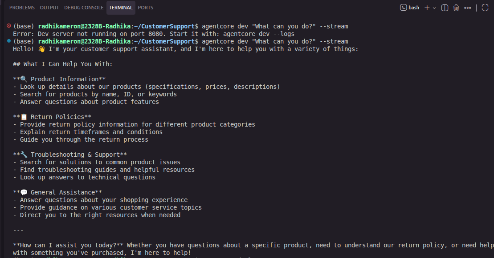

# Customer Support AI Agent

An AI-powered customer support agent built on Amazon Bedrock AgentCore.
Answers product and return policy questions using tool-calling with Claude Sonnet.



## What it does
- Looks up product information using AI tool calling
- Answers return policy questions by category
- Combines multiple tool results to answer complex questions
- Deployed serverlessly on AWS using AgentCore Runtime

## Architecture
```
User question
  → AgentCore Runtime (AWS)
    → Customer Support Agent (Strands SDK)
      → Claude Sonnet via Amazon Bedrock
        → Tool: get_product_info() or get_return_policy()
          → Agent generates final response
            → User
```

## Tech stack
- Python 3.12
- Amazon Bedrock AgentCore
- Strands Agents SDK
- Claude Sonnet 3.5 via Amazon Bedrock
- AWS CDK for infrastructure
- IAM, CloudWatch, Lambda

## How to run locally
```bash
# Clone the repo
git clone https://github.com/1radhika2/customer-support-ai-agent.git
cd customer-support-ai-agent

# Install AgentCore CLI
npm install -g @aws/agentcore

# Configure AWS credentials
aws configure

# Start local dev server
agentcore dev
```

## What I learned
- How the ReAct pattern works in practice — the LLM reads tool docstrings to decide which tool to call
- How AWS AgentCore handles serverless deployment of AI agents using CDK under the hood
- How system prompt quality directly changes agent behaviour — tested this by modifying the prompt and observing differences

## Status
- [x] Project scaffolded
- [x] Custom tools added
- [x] Tested locally
- [x] Deployed to AWS
- [ ] README completed with screenshots
